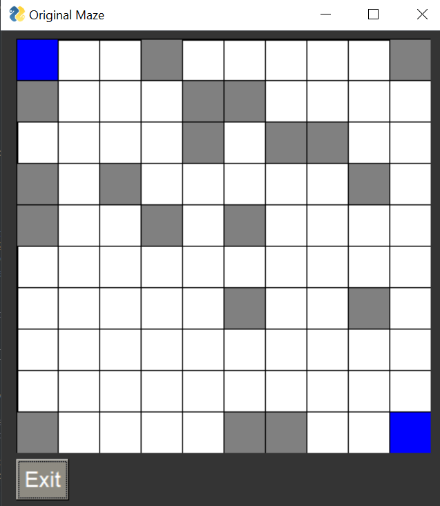
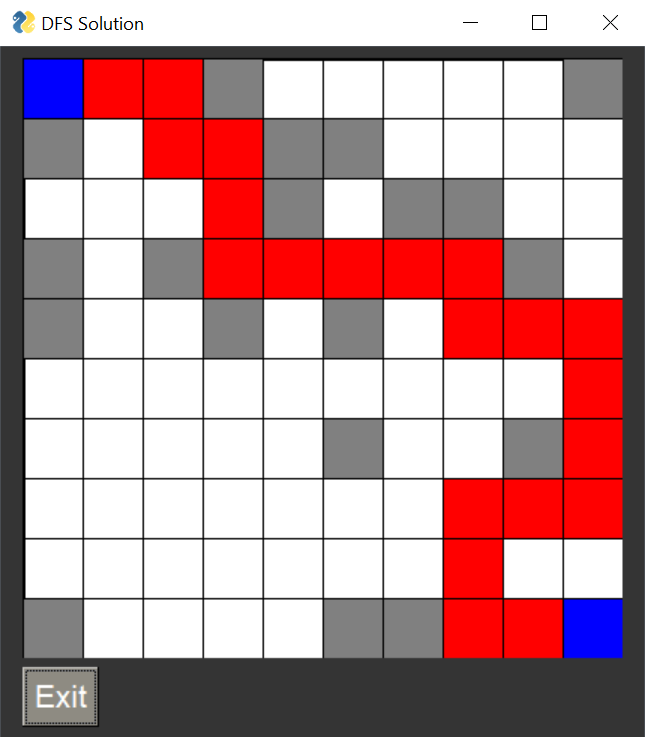
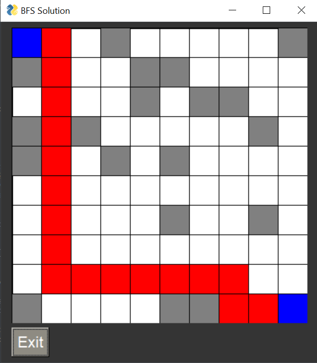

<!-- ABOUT THE PROJECT -->

## About The Project

This project is just for practicing of path finding algorithms and GUI module `PysimpleGUI`.

I create a random maze and the goal is to find the path from the `START` -----> `DESTINATION` (2 blue box in the image) using different searching path algorithms like `bfs`, `dfs` and `A*`

  <ins>_Example for Solutions_<ins> 

- **DFS solution**:

    

- **BFS solution**:

    
